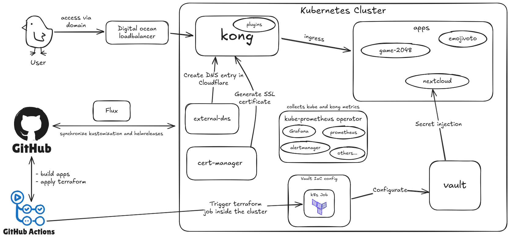

# kubernetes-on-digitalocean

## 1. DigitalOcean Kubernetes Infrastructure with Terraform & Flux

This project was created to demonstrate automated deployment of a Kubernetes cluster on DigitalOcean using Terraform and GitOps practices. It uses Flux to synchronize Helm charts and YAML manifests for key services such as Kong (Ingress Controller), Vault (Secrets Management), and the Prometheus stack (Monitoring & Alerting).

It highlights my ability to manage cloud infrastructure, automate CI/CD pipelines, and ensure secure service delivery.

## 2. Features

1. 🛠️ Infrastructure provisioning with **Terraform**
2. 📦 Application deployment using **Flux**
3. 🔑 **Vault** for secure secret management
4. 📊 **kube-prometheus** stack for monitoring and alerting
5. 🌐 **Kong** (Ingress Controller) to manage external traffic routing to Kubernetes services.
6. 📛 **external-dns** to automatically manage DNS records on Cloudflare.
7. 🔐 **cert-manager** to automate TLS certificate provisioning with Let's Encrypt.
8. ⚙️ **GitHub Actions** pipelines for CI/CD—automating Terraform and application deployment.

## 3. Infrastructure diagram

<picture>
  <source media="(prefers-color-scheme: dark)" srcset="images/infra-diagram-dark.png">
  <source media="(prefers-color-scheme: light)" srcset="images/infra-diagram-light.png">
  
</picture>

## 4. Prerequisites

To replicate this, contribute or just play around with kubernetes you will need:

1. CloudFlare account with a domain - to access the apps using a domain
2. DigitalOcean account and API token - to deploy the infrastructure
3. HCP Terraform account and API token - to store terraform state
4. GitHub repository
5. Useful CLI tools: terraform, kubectl, flux, gh, dig

## 5. Quick Installation Guide

1. Fork the repository
2. In the github repository set:
   - Variables:
     1. ADMIN_IP
     2. DIGITALOCEAN_USERNAME
   - Secrets:
     1. CLOUDFLARE_TOKEN
     2. DIGITALOCEAN_API_TOKEN
     3. FLUX_GITHUB_TOKEN
     4. HCP_TERRAFORM_TOKEN
3. Trigger the terraform pipeline, that should create all the infrastructure
4. Unseal the Vault
   - for the first time running the initial configuration in `vault-iac/initial-configuration` is required to set up vault to work with jobs triggered by github _terraform vault_ pipeline, [instruction](vault-iac/initial-configuration/README.md)
5. Trigger terraform vault pipeline
6. Internal tools and apps should deploy in the cluster automatically, flux will synchronize all Kustomizations and HelmReleases

## 6. Terraform

In the project I used multiple providers: including `digitalocean`, `flux`, `kubernetes` and `vault`

- `digitalocean` provider is used to manage infrastructure, the k8s cluster, container registry, etc
- `flux` provider is used to bootstrap Flux on the cluster to enable GitOps workflows
- `kubernetes` provider is used to deploy kube manifest to the cluster, particularly flux specific resourcses like `HelmRepository`, `HelmRelease`, `Kustomization`.  
  I used this provider to deploy cert-manager resources. While the primary goal of using the kubernetes provider was to demonstrate Terraform's capabilities, one could argue that it is suitable for managing core cluster components, while user applications are better handled through Flux.

Secret values are specified using _terraform variables_ and injected via GitHub secrets in the GitHub Actions pipeline.

For convenience and to enable execution within GitHub Actions, I used the HCP Terraform (Cloud) backend to store the state file. It fits well with this use case, particularly due to its free tier.

## 7. Kong

In this project I've implemented Kong as an Ingress Controller showcasing its capabilities. In this setup I have integrated it with external-dns to automate DNS provisioning and cert-manager to obtain SSL certificate for the domains served by Kong.

- Flux CD Integration
  - I utilized helm chart provided by kong `kong/ingress`, this is a _meta chart that deploys an opinionated Kong Ingress Controller with Kong Gateway_. That chart provided me with fairly easy deployment that I configured further using helm values.
- Security Enhancements
  - cert-manager for automatic TLS certificate management
  - wildcard certificate for my domain \*.kzwolenik.com
  - Implemented IP restriction using KongPlugin to limit access to Grafana, enhancing security
- Observability
  - using Kong plugin I enabled Prometheus metrics
  - using file-log plugin I enabled detailed request log for better insight
- Network Configuration
  - I set up TLS pass-through and proxy protocol on the DigitalOcean load balancer to enable kong to filter traffic by IP

## 8. Vault

- Flux CD Integration
  - GitOps-based deployment of Vault, ensuring version-controlled and declarative infrastructure using official HashiCorp helm chart
- Secure Deployment
  - Vault deployed within the cluster, not exposed externally, enhancing security
- Infrastructure as Code (IaC)
  - Configured Vault using Terraform, demonstrating IaC use case
- Integration with Applications
  - Demonstrated Vault integration with a Nextcloud deployment, showcasing practical secret injection

## 9. kube-prometheus stack

- Prometheus Operator
  - Utilized the Prometheus Operator for simplified deployment and management of Prometheus
- Jsonnet Configuration
  - Implemented a custom Jsonnet file to generate Kubernetes manifests, showcasing adaptability to new tools and languages
  - Configured monitoring for specific namespaces, including 'kong-system'
- Grafana
  - Implemented Ingress for Grafana with Kong Ingress Controller integration

## 10. Summary

This project showcases my ability to deploy a robust, secure, and observable k8s cluster. By integrating various cloud-native technologies and following best practices, I've demonstrated my expertise in modern DevOps methodologies and my commitment to creating high-quality infrastructure solutions.

Throughout the project, I encountered numerous errors and issues that required troubleshooting to ensure seamless operation. This learning process, though challenging to describe in a project summary, was crucial to the project's success and my professional growth.
